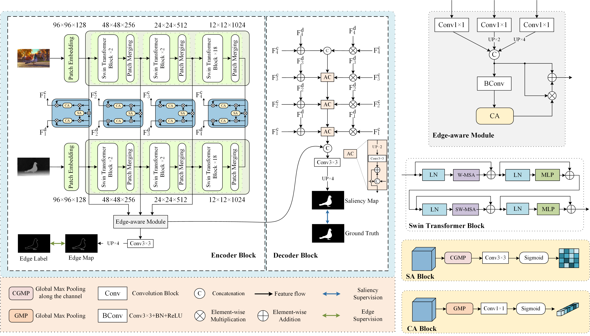

# SwinNet: Swin Transformer drives edge-aware RGB-D and RGB-T salient object detection

The paper has been online published by IEEE Transactions on Circuits and Systems for Video Technology.

The details are in http://arxiv.org/abs/2204.05585

DOI:
https://dx.doi.org/10.1109/TCSVT.2021.3127149

Revision：[paper](https://github.com/liuzywen/SwinNet/blob/main/SwinNetRevision.pdf)


 

## Training Set
2185
https://drive.google.com/file/d/1fcJj4aYdJ6N-TvvxSZ_sBo-xhtd_w-eJ/view?usp=sharing


2985
https://drive.google.com/file/d/1mYjaT_FTlY4atd-c0WdQ-0beZIpf8fgh/view?usp=sharing

## Testing Set


Google
https://drive.google.com/file/d/1dQWrhO-LHVACDKCTrvdc6eIbcyH7Yzp_/view?usp=sharing

Baidu：https://pan.baidu.com/s/1fN-AsBiKTbMRsye0Lr8K7g 
提取码：l2u9 


## Pretraining Parameter
Swin Transformer Parameter: https://github.com/SwinTransformer/storage/releases/download/v1.0.0/swin_base_patch4_window12_384_22k.pth


Our RGB-D SOD Parameters: 

Google: https://drive.google.com/file/d/1amFbdnGefUaej1NMb2EOVgsMoQ4zabe_/view?usp=sharing


Baidu：https://pan.baidu.com/s/1ouefnVNRfUwck3zNV9J2Dw 
提取码：c4ix 

Our RGB-T SOD Parameter: 

Google： https://drive.google.com/file/d/1rD19-p7M2bv0btjZ11DoZZ3zY9qxXp03/view?usp=sharing


Baidu：https://pan.baidu.com/s/1xuDNtr3x-Foi-o9QaYMWuw 
提取码：nqh2 


##  RGBD Result Saliency Maps 

Google: https://drive.google.com/file/d/1tiHhSPocBZR3rO6XxIZm3ICHMQxRngci/view?usp=sharing


Baidu：https://pan.baidu.com/s/1jGL47H9hucbTxrNvj2uRXw 
提取码：4gas

##  RGBT Result Saliency Maps 
Google: https://drive.google.com/file/d/1r072vcAtA7UHprRo1K1clLEZzDYAXCKc/view?usp=sharing


Baidu：https://pan.baidu.com/s/1nneg3IIHi62NebLdyI7M-w 
提取码：9pde

## Evaluation Code

Google: https://drive.google.com/file/d/1-fXbORnXNVfvm7uarXLX6w9PuVhs-25d/view?usp=sharing

Baidu：https://pan.baidu.com/s/1EtKTNVPQAW_iLm8pA1POmQ 
提取码：86gt 

### Citation

If you find the information useful, please consider citing:

```
@article{liu2022,
  author={Liu, Zhengyi and Tan, Yacheng and He, Qian and Xiao, Yun},
  journal={IEEE Transactions on Circuits and Systems for Video Technology}, 
  title={SwinNet: Swin Transformer drives edge-aware RGB-D and RGB-T salient object detection}, 
  volume={32},
  number={7},
  pages={4486--4497},
  year={2022}}
```
If you have any question, please email  liuzywen@ahu.edu.cn
